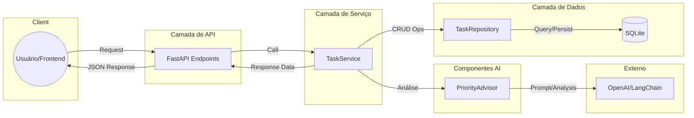

# Arquitetura de Componentes

Diagrama representativo das camadas da API e o fluxo de interação entre os componentes e serviços externos.

## Descrição das Camadas
- **API Layer**: Gerencia as rotas, validações de entrada (Pydantic) e serialização de saída.
- **Service Layer**: Contém a lógica de negócio e orquestra a interação entre o repositório e os componentes de IA.
- **PriorityAdvisor**: Especialista em interagir com LLMs para extrair insights de priorização das tarefas.
- **Data Layer**: Abstrai o acesso ao banco de dados SQLite utilizando o padrão Repository.
