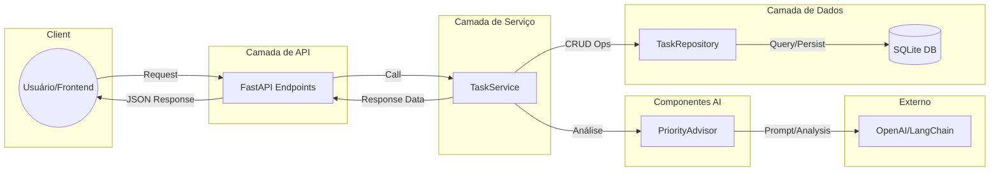

# Arquitetura de Componentes

Diagrama representativo das camadas da API e o fluxo de interação entre os componentes e serviços externos.

## Descrição das Camadas
- **API Layer**: Gerencia as rotas em `app/api/task_routes.py`, agora devidamente integradas ao `app/main.py`.
- **Service Layer**: O `TaskService` orquestra a lógica de negócio, garantindo que a persistência e a IA trabalhem em harmonia.
- **PriorityAdvisor**: Especialista em análise de contexto (Híbrido: LLM + Heurística Local).
- **Data Layer**: O `TaskRepository` utiliza **SQLModel** para persistência no banco de dados SQLite (`database.db`). A conexão é gerenciada por sessões injetadas via dependência do FastAPI.

## Fluxo de Dados Persistente
1. O `TaskRepository` recebe uma sessão ativa do banco de dados.
2. Os modelos `Task` do SQLModel mapeiam diretamente as tabelas do SQLite.
3. As operações de escrita (save/update/delete) executam o `commit()` na base física, garantindo a durabilidade dos dados.
