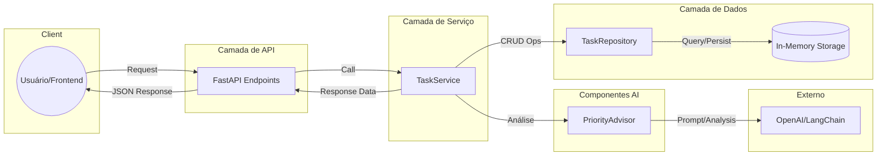

# Arquitetura de Componentes

Diagrama representativo das camadas da API e o fluxo de interação entre os componentes e serviços externos.

## Descrição das Camadas
- **API Layer**: Gerencia as rotas em `app/api/task_routes.py`, validações de entrada via schemas Pydantic e serialização de saída.
- **Service Layer**: O `TaskService` orquestra a lógica de negócio (SRP). Ele decide quando acionar a IA para sugestão de prioridade e coordena a persistência.
- **PriorityAdvisor**: Componente com lógica híbrida. Tenta integração com LLM (OpenAI) e possui fallback para heurística local baseada em palavras-chave.
- **Data Layer**: O `TaskRepository` isola a persistência. Atualmente utiliza um dicionário em memória com geração automática de metadados (UUIDs, Timestamps).

## Fluxo de Criação de Tarefa
1. O usuário envia os dados básicos da tarefa.
2. O `TaskService` solicita uma sugestão de prioridade ao `PriorityAdvisor`.
3. O `PriorityAdvisor` retorna uma prioridade (via IA ou Heurística).
4. O `TaskService` envia os dados + sugestão para o `TaskRepository`.
5. O `TaskRepository` gera o ID, datas de criação/atualização e armazena o objeto.
